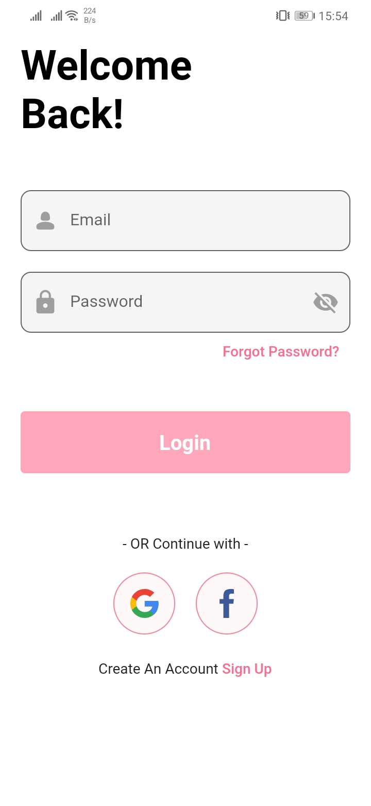
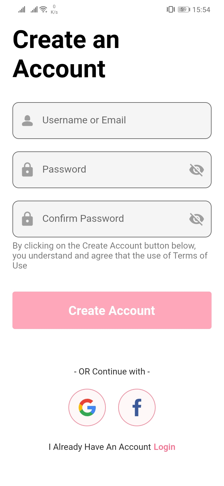
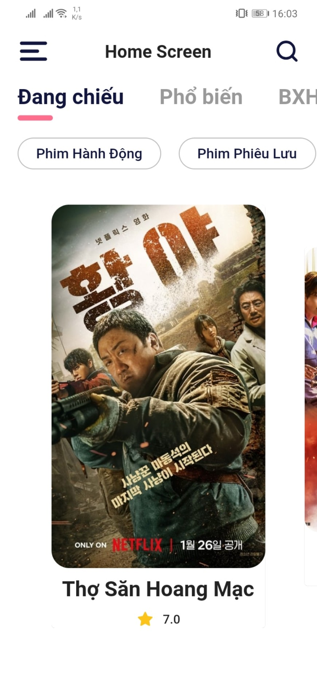
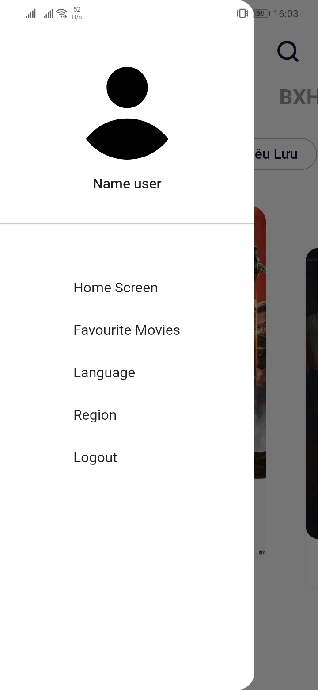
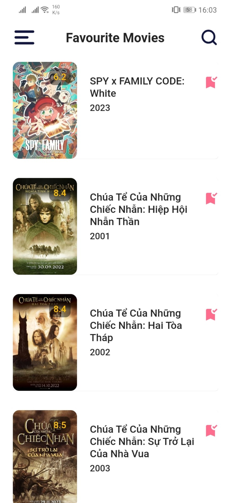
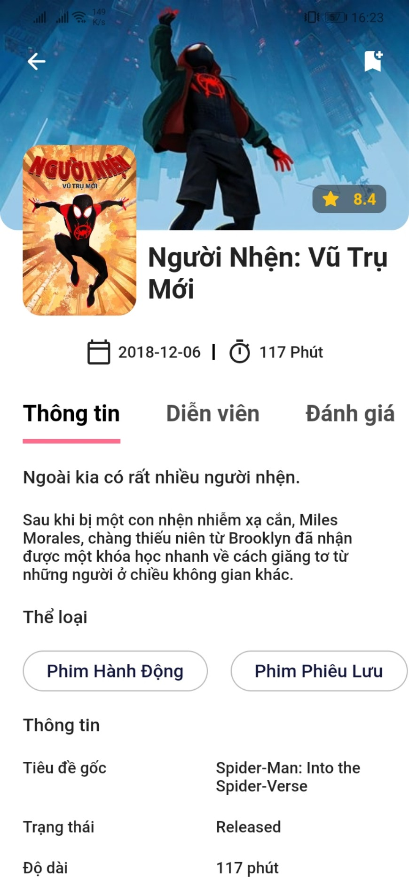
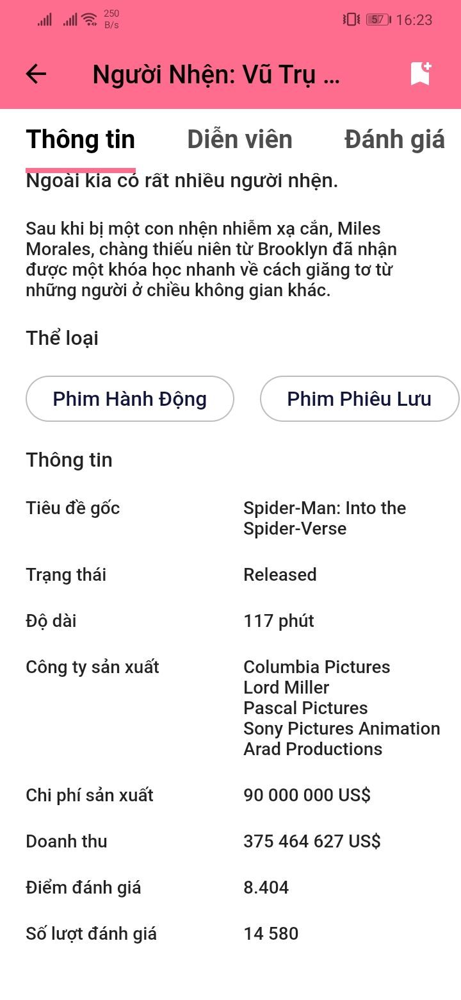
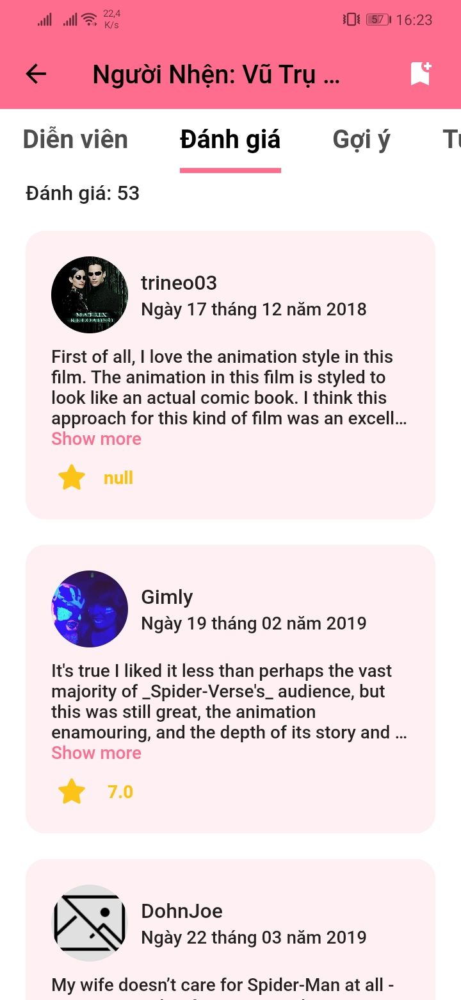

# Movie App

This project is developing.

App can login and sign up.
App can store your favourite movies on cloud.

<table>
  <tr>
    <td>First Screen Page</td>
     <td>Holiday Mention</td>
     <td>Present day in purple and selected day in pink</td>
  </tr>
  <tr>
    <td></td>
    <td></td>
    <td></td>
  </tr>
 </table>

## Login Screen

## Sign Up Screen

## Home Screen

## Side Bar

## Favourite Movies Screen

## Search Screen

## Movie Detail Screen

## Getting Started

This project is a starting point for a Flutter application.

A few resources to get you started if this is your first Flutter project:

- [Lab: Write your first Flutter app](https://docs.flutter.dev/get-started/codelab)
- [Cookbook: Useful Flutter samples](https://docs.flutter.dev/cookbook)

For help getting started with Flutter development, view the
[online documentation](https://docs.flutter.dev/), which offers tutorials,
samples, guidance on mobile development, and a full API reference.
