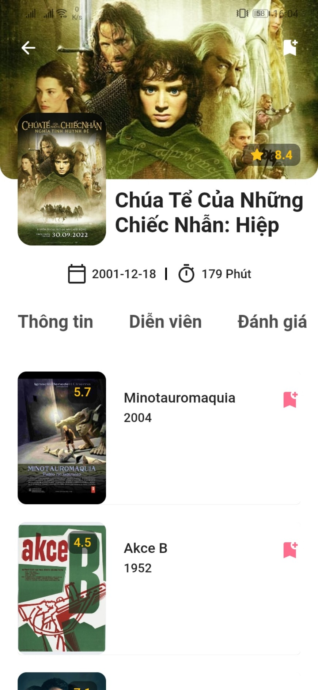

# Movie App

This project is developing.

App can login and sign up.
App can store your favourite movies on cloud.

<table>
  <tr>
    <td>Login Screen</td>
     <td>Sign Up Screen</td>
  </tr>
  <tr>
    <td></td>
    <td></td>
  </tr>
 </table>

 <table>
  <tr>
    <td>Home Screen</td>
     <td>Side Bar</td>
  </tr>
  <tr>
    <td></td>
    <td></td>
  </tr>
 </table>

<table>
  <tr>
    <td>Search Screen</td>
     <td>Favourite Screen</td>
  </tr>
  <tr>
    <td></td>
    <td></td>
  </tr>
 </table>

 <table>
  <tr>
    <td>Movie Detail Screen 1</td>
     <td>Movie Detail Screen 2</td>
  </tr>
  <tr>
    <td></td>
    <td></td>
  </tr>
 </table>

 <table>
  <tr>
    <td>Movie Detail Screen 3</td>
     <td>Movie Detail Screen 4</td>
  </tr>
  <tr>
    <td></td>
    <td></td>
  </tr>
 </table>

 <table>
  <tr>
    <td>Movie Detail Screen 5</td>
     <td>Movie Detail Screen 6</td>
  </tr>
  <tr>
    <td></td>
    <td></td>
  </tr>
 </table>

## Getting Started

This project is a starting point for a Flutter application.

A few resources to get you started if this is your first Flutter project:

- [Lab: Write your first Flutter app](https://docs.flutter.dev/get-started/codelab)
- [Cookbook: Useful Flutter samples](https://docs.flutter.dev/cookbook)

For help getting started with Flutter development, view the
[online documentation](https://docs.flutter.dev/), which offers tutorials,
samples, guidance on mobile development, and a full API reference.
